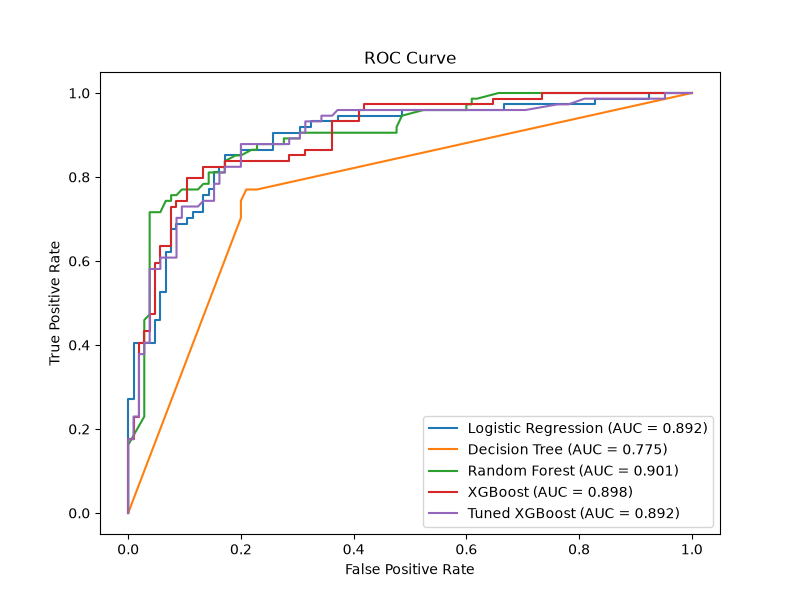
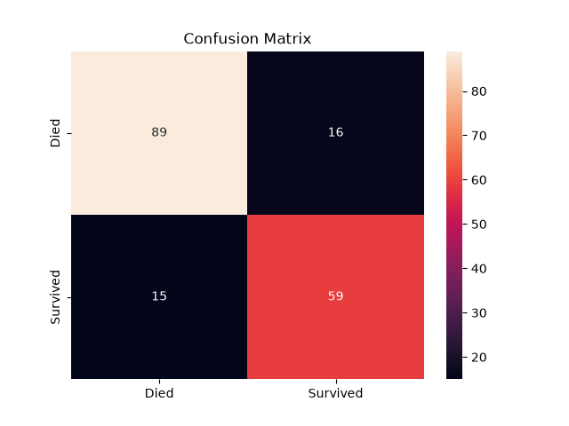

# Titanic Survival Prediction — ML Pipeline

A complete machine learning pipeline built on the Titanic dataset — from raw data to a tuned, containerized model. The goal was not to solve Titanic specifically, but to build a proper ML workflow: EDA, feature engineering, model selection with cross-validation, hyperparameter tuning, and evaluation.

---

## Dataset

891 passengers, 12 columns. Overall clean — only 2 missing Embarked values. Two problematic columns:
- `Cabin` — 77% missing, too sparse to use directly
- `Age` — ~150 missing values out of 891, required careful imputation

---

## EDA Findings

**Sex is the strongest predictor of survival** — women survived at 74%, men at 19%. This single feature alone makes most of the difference.

**Age matters but non-linearly** — children under 10 had ~60% survival rate, reflecting the "women and children first" evacuation policy.

**Family size has a sweet spot** — passengers traveling alone or with very large families had worse survival chances. Small family units (2-4 people) fared noticeably better.

**Cabin as a binary signal** — even though 77% of cabin values were missing, the mere fact of having a recorded cabin correlated with higher survival, even within 1st class. Likely a proxy for wealth and deck position.

**Passenger class** — strong linear relationship with survival. 1st class passengers had significantly better access to lifeboats.

---

## Feature Engineering

| Decision | Reason |
|---|---|
| Drop `Cabin`, add binary `Has_Cabin` | 77% missing — unusable raw, but the fact of having one is informative |
| Fill missing `Embarked` with mode | Only 2 values missing, mode is safe and simple |
| Extract `Title` from `Name` | Encodes sex and approximate age in one feature (Mr, Mrs, Miss, Master) |
| Hierarchical `Age` imputation | Title+Pclass → Pclass → Title → overall mean. More accurate than a single global mean |
| Create `FamilySize` from SibSp + Parch + 1 | EDA showed family size has non-linear impact on survival |
| Create `IsSingle` binary from FamilySize | Lone travelers — mostly men — had significantly lower survival rates |

The most important decision was the hierarchical Age imputation. A `Master` in 3rd class has a very different expected age than a `Mr` in 1st class — using a single global mean would have introduced significant noise into one of the most predictive features.

All transformations are encapsulated in a custom `TitanicPreprocessor` sklearn transformer that learns statistics only from training data during `fit()` and applies them in `transform()`. This prevents any data leakage from the validation set into the preprocessing steps.

---

## Model Comparison — 5-Fold Cross-Validation

All models evaluated with 5-fold CV on the training set. AUC is used as the primary metric — it measures how well the model separates survivors from deaths across all thresholds, making it more informative than accuracy on an imbalanced dataset.

| Model | Accuracy | AUC |
|---|---|---|
| Logistic Regression | 0.8300 ± 0.0209 | 0.8615 ± 0.0249 |
| Decision Tree | 0.7585 ± 0.0421 | 0.7477 ± 0.0412 |
| Random Forest | 0.7992 ± 0.0158 | 0.8495 ± 0.0252 |
| XGBoost (default) | 0.7865 ± 0.0098 | 0.8457 ± 0.0051 |
| **Tuned XGBoost** | — | **0.8690** |

Logistic Regression leads on default models. After feature engineering the data is largely linearly separable — Title, Sex, Pclass, and FamilySize are all strong linear signals, which plays directly into Logistic Regression's strengths.

XGBoost with defaults showed the lowest std (0.0051) but underperformed on mean AUC — consistently conservative, not complex enough. This is underfitting caused by the default learning_rate=0.3 taking steps that are too large. Worth tuning.

**GridSearchCV** over 27 combinations (3 × 3 × 3), 5-fold CV each, 135 training runs total:

Best params:
n_estimators = 500
max_depth = 3
learning_rate = 0.01


Low learning rate + many shallow trees — the model takes small careful corrections and avoids overfitting on a small dataset. Tuned XGBoost reached CV AUC of **0.8690**, the highest of all models.

CV is used for model selection rather than the val set score to prevent optimizing toward a single lucky or unlucky random split. Random Forest scored 0.903 AUC on the val set — higher than tuned XGBoost's 0.892 — but its CV AUC of 0.8495 across 5 different splits is the more reliable picture.

---

## Final Model Performance — Tuned XGBoost




          precision    recall    f1      support

Died (0) 0.83 0.85 0.84 105
Survived (1) 0.78 0.76 0.77 74
accuracy 0.81 179

Final accuracy: 0.81
Final AUC: 0.869 (CV on training data)


The model correctly identified 89 out of 105 deaths and 56 out of 74 survivors. 16 deaths were wrongly flagged as survived (FP), 18 real survivors were missed (FN).

AUC was the primary metric for this project — the goal was to maximize separation between survivors and deaths at the least cost of wrongly calling a death a survival. This is not a cancer detector where missing a positive case is catastrophic, and not a spam filter where false positives are the main concern. AUC reflects the overall quality of the model's ranking across all thresholds, which is the right measure here.

---

## What I Learned

- How Logistic Regression, Decision Trees, Random Forest and XGBoost work under the hood — not just as black boxes but the actual math behind gradients, residuals, and tree splits
- How complex and elegant XGBoost is — using second order Taylor expansion of the loss to find optimal leaf values, making it both precise and fast
- How important EDA and feature engineering are — the best model at the end of a well-engineered pipeline is often not the most complex one
- What data leakage is and exactly how to prevent it using the sklearn Pipeline fit/transform separation
- What ROC-AUC actually measures and why it is more informative than accuracy on imbalanced data
- How CV prevents lucky or unlucky val set splits from driving model selection decisions
- Why the choice of evaluation metric depends on the business problem, not just the data

---

## How to Run

### Locally

```bash
pip install -r requirements.txt
python -m src.train
```

### Docker

```bash
docker build -t titanic-ml .
docker run --rm titanic-ml
```

Training saves the best pipeline to `src/models/pipeline.joblib` and plots to `outputs/`.